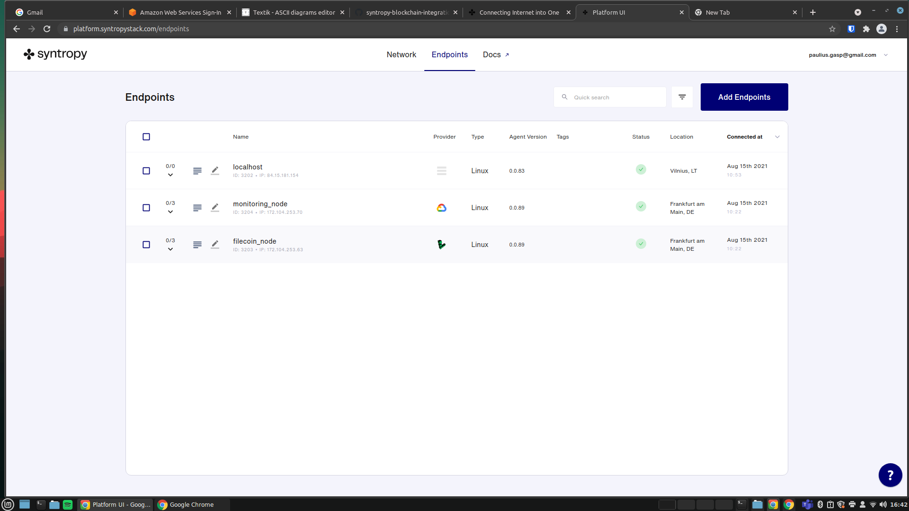
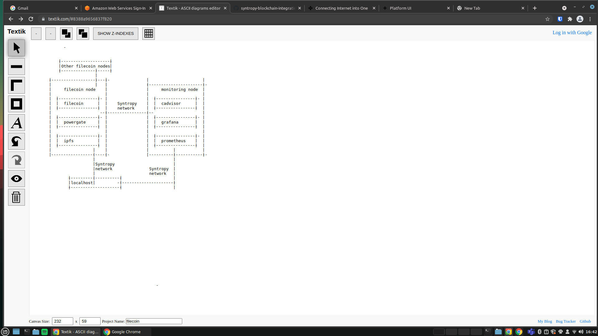
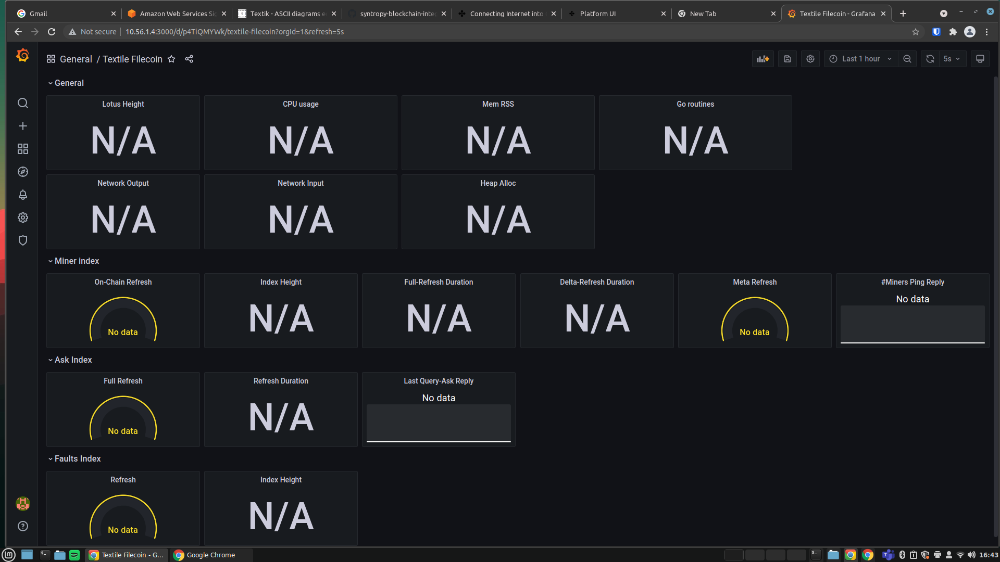

# Setup a secure Filecoin node using the Syntropy Stack

This integration can help exchanges, on-chain data analysts, node runners, etc. setup a secure, stable and monitored filecoin node.
The Ansible playbook configure the filecoin node and monitoring. To ensure security and stability all of the connections between the filecoin node and the monitoring solution are made through a private Syntropy network.

## Topology


## Benefits

The integration provides a few tangible benefits to different stakeholders:
* Exchanges can now manage their multi-cloud node infrastructure easily without having to worry about network connections and security between the instances.
* Less technical node-runners can easily setup a secure and observable filecoin node
* On-chain filecoin data analysts can manage filecoin node clusters on multiple clouds with additional observability

## Requirements

There are some prerequisites to use this example:

* An active Google Cloud Platform account with billing enabled
* An active Linode Cloud account
* Python >= 3.6
* Terraform and Ansible >= 2.10 installed on your local machine
* A Linux machine to run the Ansible playbook


## Variables

In order for Terraform and Ansible to be able to set up everything automatically,
you will need to input a few variables in `infra/terraform.tfvars` and 
`ansible/vars/main.yml`. The examples for these can be found in their respective
`.example` files.

Useful links for generating the variables:

1. [How to generate Linode Personal Access Token](https://www.linode.com/docs/guides/getting-started-with-the-linode-api/)
2. [How to generate Google Cloud Platform service key](https://cloud.google.com/iam/docs/creating-managing-service-account-keys)
3. [How to generate a Syntropy Agent Token](https://docs.syntropystack.com/docs/get-your-agent-token)


## Provisioning infrastructure

After you have filled in your Terraform and Ansible variables, you can start
creating your virtual machines. This is a simple step and only requires two
commands (in the `infra` directory):

```
terraform init
terraform apply
```

## Deploying the Filecoin node and monitoring services using Ansible

After the virtual machines are done setting up, you can start provisioning
the Filecoin node and monitoring services (Grafana, Prometheus).
In order to do this, only one command has to be run:

```
ANSIBLE_HOST_KEY_CHECKING=false ansible-playbook -i inventory.yml main.yaml
```

This can take a while, since a lot is done in this playbook (takes about 15-20 min, so take your eyes off the screen).


## Checkout the network setup on Syntropy Platform

If the script has executed completely, the endpoints will be visible on your Syntropy Stack UI.



Then you can connect your endpoints and activate services in order to achieve a properly working blockchain network.



## Visiting the monitoring site

You can visit the Grafana instance with the link `http://10.50.1.3:3000` and entering
the credentials you entered in the `vars/main.yml` file.

After logging in, you should be able to visit the your grafana dashboard. Note! You will be required to wait for your node to finish syncing until data can be desiplayed on the Grafana dashboard.

